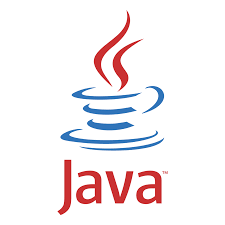

# TEAM4 EVENTS

## DESCRIPCIÓN DEL PROYECTO UPCOMING EVENTS

NUestro proyecto consiste en el desarrollo de una aplicación y web para aquellos usuario interesados en eventos musicales, además de masterclass relacionadas con la música. Como usuario, se podrán registrar en nuestra página lo que le dará el privilegio de buscar entre todos los eventos musicales que ofrecemos y registrarse en aquellos que le puedan interesar. Además tendrá la posibilidad de cancelar el registro a un evento concreto y de ver aquellos que ya no están disponible poruqe ya han tenido lugar o bien porque el aforo se ha completado. Todo ello podrá verlo en su dashboard de usuario una vez logueado. Además del registro y el log in de usuario, también el administrador de la web podrá tener acceso a su dashboard donde podrá editar y eliminar los eventos, así como añadir nuevos eventos a la lista.

## RESULTADO FINAL 


 


## USER FLOW Y TABLA RELACIONAL


## DISEÑO DE LA WEB CON FIGMA


## LENGUAJES UTILIZADOS :rocket:

<div>
    
    
    
    
 </div>
   


## HERRAMIENTAS UTILIZADAS :hammer:
<div>
    
    
    
    
     
    
    
    
</div>

## COLABORADORES/AS:

- [Daniel Gallo](https://github.com/DanielGallo84)
- [Matilde García](https://github.com/MatigarciaS)
- [Ana García](https://github.com/anagarlopez)
- [Brusmel Gil](https://github.com/BrusmelGil) 
- [Rebeca Martínez](https://github.com/RebecaMFep)


>[!IMPORTANT]
> ¿Cómo se instala?  🖥️
>
## INSTALACIÓN DEL PROYECTO 
```
npm install
npm run dev
```

## PRODUCCIÓN 
```
npm run build
npm run preview
```# 

This template should help get you started developing with Vue 3 in Vite.

## Recommended IDE Setup

[VSCode](https://code.visualstudio.com/) + [Volar](https://marketplace.visualstudio.com/items?itemName=Vue.volar) (and disable Vetur) + [TypeScript Vue Plugin (Volar)](https://marketplace.visualstudio.com/items?itemName=Vue.vscode-typescript-vue-plugin).

## Customize configuration

See [Vite Configuration Reference](https://vitejs.dev/config/).

## Project Setup

```sh
npm install
```

### Compile and Hot-Reload for Development

```sh
npm run dev
```

### Compile and Minify for Production

```sh
npm run build
```

### Run Unit Tests with [Vitest](https://vitest.dev/)

```sh
npm run test:unit
```


# upcoming events team 4


lo que sea

This template should help get you started developing with Vue 3 in Vite.

## Recommended IDE Setup

[VSCode](https://code.visualstudio.com/) + [Volar](https://marketplace.visualstudio.com/items?itemName=Vue.volar) (and disable Vetur) + [TypeScript Vue Plugin (Volar)](https://marketplace.visualstudio.com/items?itemName=Vue.vscode-typescript-vue-plugin).

## Customize configuration

See [Vite Configuration Reference](https://vitejs.dev/config/).

## Project Setup

```sh
npm install
```

### Compile and Hot-Reload for Development

```sh
npm run dev
```

### Compile and Minify for Production

```sh
npm run build
```

### Run Unit Tests with [Vitest](https://vitest.dev/)

```sh
npm run test:unit
```
